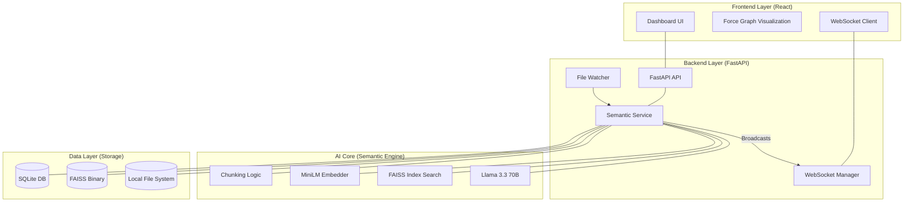

# SEFS System Architecture

This document describes the internal architecture of the **Semantic File System (SEFS)**, detailing how components interact to provide AI-powered file organization.

---

## 🏗️ High-Level Component Diagram

The system follows a modern client-server architecture with a specialized AI processing pipeline in the backend.

---

## 🌊 Core Data Flows

### 1. File Indexing & Clustering Flow
When a file is added to the `monitored_root` or uploaded:

1.  **Watcher/API**: Detects a new file.
2.  **Chunking**: The file is split into 512-token chunks.
3.  **Embedding**: Each chunk is converted into a 384-dimensional vector using `all-MiniLM-L6-v2`.
4.  **Persistence**:
    *   Chunks and vectors are stored in **SQLite**.
    *   Vectors are added to the **FAISS Index**.
    *   The index is saved to `faiss_index.bin`.
5.  **Clustering**:
    *   The system performs a similarity search across all chunks.
    *   It builds a graph of "connected components" based on a similarity threshold (default 0.7).
    *   Connected files form a **Cluster**.
6.  **Naming**: If a new cluster is formed, the **LLM** (Llama 3.3) analyzes a sample of files to generate a semantic name.

### 2. Search & Retrieval
1.  **Query**: User enters a search query.
2.  **Vectorization**: The query is converted into an embedding using the same MiniLM model.
3.  **FAISS Search**: The system finds the nearest vectors in the FAISS index.
4.  **Ranking**: Results are aggregated and ranked by similarity.

---

## 📁 Storage Architecture

| Component | Technology | Role |
| :--- | :--- | :--- |
| **`vectors.db`** | SQLite | Stores file metadata, chunk content, cluster assignments, and caching logs. |
| **`faiss_index.bin`** | FAISS Binary | A serialized HNSW or Flat index for high-speed vector similarity lookups. |
| **`monitored_root/`** | File System | The source of truth for physical files. |
| **`upload_storage/`** | File System | Temporary storage for files uploaded directly via the web interface. |

---

## 📡 Communication Protocol

- **RESTful API**: Used for standard CRUD operations (upload, search, settings).
- **WebSockets**: Used for real-time state synchronization.
    - **Events**: `file_added`, `file_moved`, `cluster_updated`, `processing_progress`.
- **CORS**: Configured to allow cross-origin requests from the React development server (`localhost:5173`) to the FastAPI backend (`localhost:8000`).

---

## 🛡️ Threading & Concurrency

- **FastAPI**: Uses `async/await` for high-throughput API handling.
- **File Watcher**: Runs in a separate thread to avoid blocking the main event loop.
- **LLM/Embedder**: Uses a `ThreadPoolExecutor` for CPU-intensive or long-running tasks like embedding or cluster re-generation.
- **File Locking**: Implements a custom `FileLockManager` to prevent race conditions between file operations and system event handling.
